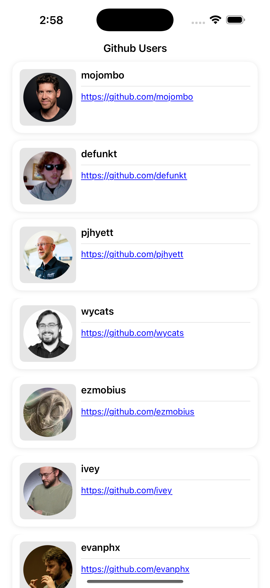
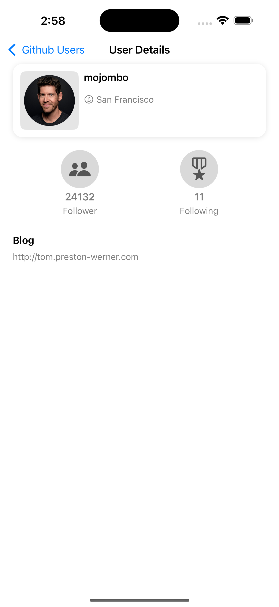

# NguyenMinhTuan

A modular iOS application built with UIKit, following MVVM-C & Clean Architecture pattern principles.

## 🏗 Architecture Overview

This project implements a modular clean architecture combined with Clean Architecture principles and MVVM-C pattern for the presentation layer.

### Requirements
- iOS 15.0+
- Xcode 16+
- Swift Package Manager

## 📦 Module Structure

### 🎯 Main App
- **UserManagerTymeX** - Main application target integrating all modules

### 🔨 Core Modules
#### Domain
- Business models
- Use cases
- Repository interfaces
- Business rules & logic

#### AppCommon
- Common utilities
- Shared extensions
- Base components
- Common protocols
- Coordinator

#### DependencyInjection
- Config Dependency

### 💾 Data Layer

#### Data
- Repository implementations
- Data mapping
- CRUD operations
- Cache strategies

#### Infrastructure
- API client
- Network requests/responses
- DTOs
- Network error handling

#### LocalStorage
- Data persistence
- Caching logic
- CoreData management

### 🎪 Feature Modules
#### UserPresentation
- User List
- User Detail

